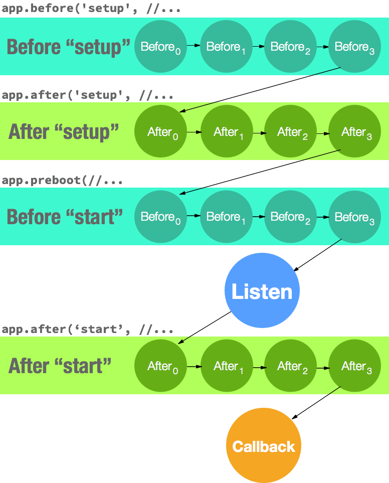

[](https://travis-ci.org/godaddy/slay)

Rock-solid structured application layout for building APIs and web apps in Node.js.

- [Motivation](#motivation)
  - [Application layout](#application-layout)
  - [What is a "preboot"?](#what-is-a-preboot)
  - [Consistent application startup](#consistent-application-startup)
- [Usage](#usage)
- [API documentation](#api-documentation)
  - [App](#app)
  - [Interceptors](#interceptors)
  - [Stacks](#stacks)
  - [App startup in-detail](#app-startup-in-detail)
- [Tests](#tests)

## Motivation

The goal of `slay` is to provide the absolute minimum amount of consistency in a Node.js
application without forcing an enormous amount of convention onto users. The consistency
goal also centers around encouraging modularity in application-level code for maximum reuse.
This is accomplished through three simple features: [application layout](#application-layout), ["preboots"](#what-is-a-preboot), and a [consistent application startup](#consistent-application-startup).

### Application layout

By convention `slay` looks for user-defined modules in the following locations:

```
lib/preboots
lib/middlewares
lib/routes
```

This is done using standard, built-in Node.js module loading which means that each of these could be individual files of the same name instead of folders. Feel free to mix and match as your application's complexity grows. e.g.:

```
lib/preboots/index.js
lib/middlewares.js
lib/routes/index.js
```

### What is a "preboot"?

> "A preboot is a middleware for application extensibility"

That is, instead of `function (req, res, next)` a preboot is `function (app, options, done)`.
By enforcing a consistent function signature to application extensibility all require ordering
problems become trivial. For example:

**lib/preboots/index.js**
``` js
module.exports = function (app, options, done) {
  //
  // **SCHEDULE** the attachment and initialization of
  // connections to our models.
  //
  app.preboot(require('./models'));
  done();
};
```

**lib/preboots/models.js**
``` js
module.exports = function (app, options, next) {
  //
  // Attach all of the models for our API / microservices
  // to the app itself and connect to them
  // (e.g. initialize TCP sockets, etc).
  //
  app.models = require('../models');
  app.models.connect(next);
};
```

While this may seem **too obvious** it does several things:

1. Makes application extensibility simple and elegant. No complex plugin system required.
2. Ensures that all application extensibility is ordered in a single location: `lib/preboots/index.js`.
3. Encourages modularity through extending the core app by creating new preboots instead of creating an arbitrary, ad-hoc set of utility modules with a (potentially) much more complex internal [dependency graph].

### Consistent application startup

``` js
const slay = require('slay');
const app = new slay.App(__dirname);
app.start(options, function (err) {
  if (err) { throw err; }
  app.log.info(`Listening on ${app.config.get('http')`);
});
```

Calling `app.start` above will trigger two main interceptors:

1. `"setup"` interceptor.
  - `/preboots` will be loaded in `app.before('setup')`
  - `routers`
    - `app.perform('routers')` triggered in `app.before('setup')`
    - `app.router` will be available by `app.after('routers')` or by `app.perform('setup')`
2. `"start"` interceptor
  - `lib/routes` will be loaded in `app.before('start')`
    - `lib/routes/index.js` should call `app.perform('actions')` _once_ to make sure all routes from `app.router` are loaded in the app.
  - `lib/middlewares` will be loaded in `before('start')`

> For more information [look at `App.Bootstrap`][bootstrapped]

## API documentation

### App

The `App` exposed by `slay` has all of the functionality exposed by an `app` created by [express] along with:

| Method | Description                                      | Inherited from    |
| --------------- | --------------------------------------- | ----------------- |
| `App.bootstrap` | Core `slay` bootstrap flow              | `slay.App`        |
| `app.hookable`  | Defines a hookable action               | `slay.App`        |
| `app.stack`     | Defines a middleware stack              | `slay.App`        |
| `app.config`    | Config loading through `nconf`          | `config` preboot  |
| `app.log`       | Logger defined through `winston`        | `logger` preboot  |
| `app.routes`    | Top-level `express` Router              | `routers` preboot |
| `app.preboot`   | Schedule a preboot                      | `broadway`        |
| `app.mixin`     | Add functionality into the app          | `broadway`        |
| `app.start`     | Start the application                   | `broadway`        |
| `app.close`     | Gracefully shutdown the application     | `slay.App`        |
| `app.perform`   | Execute a named interceptor             | `understudy`      |
| `app.before`    | Execute _before_ a named interceptor    | `understudy`      |
| `app.after`     | Execute _after_ a named interceptor     | `understudy`      |

### Interceptors

| Name      | Description                             | Invoked by |
| --------- | --------------------------------------- | ---------- |
| `setup`   | Pre-start bootstrap setup               | `slay`     |
| `start`   | Main application startup                | `slay`     |
| `routers` | Definition of `app.routes`              | `slay`     |
| `actions` | Critical path application functionality | User       |
| `close`   | Notification to stop accepting requests | `slay`     |
| `free`    | Notification to free any held resources | `slay`     |

### Stacks

A `Stack` is a lightweight container for a set of `before` and `after` middlewares. This becomes very useful when you have potentially multiple routers in your application. A `Stack` can be defined using `app.stack` as follows:

**middlewares.js**
``` js
module.exports = function (app, options, next) {
  //
  // An authorization middleware for different roles
  // returns an HTTP middleware function when invoked.
  //
  var authorize = require('./authorize');

  //
  // Stack middlewares can be declared and used inline
  //
  app.use(
    app.stack({
      name: 'admin-only',
      before: [authorize('admin')]
    }).middleware(function (req, res, next) {
      // Dispatch (req, res) to a router.
    })
  );

  //
  // Or extended from a previous declaration and used inline
  //
  app.use(
    app.stacks['designer-only']
      .before(authorize('designer'))
      .middleware(function (req, res, next) {
        // Dispatch (req, res) to a router.
      })
  );
};
```

All `Stack` instances created by invoking `app.stack` will be exposed on the `app.stacks` object.

### App startup in-detail

1. App is [bootstrapped] and `app.start([options], callback);` is invoked.
2. `app.perform('setup')` performs `before` _"setup"_ interceptors (see: [understudy interceptors]). This executes the built-in `slay` preboots which:
  - **Creates** `app.config`(an instance of `nconf.Provider`).
  - **Creates** `app.log` (an instance of `winston.Logger`).
  - **Creates** user preboots (in your app `lib/preboots[.js]?`). This allows arbitrary user-defined preboots for extensibility in a sync or async fashion.
  - **Schedules** middlewares (in your app `lib/middlewares[.js]?`).
  - **Schedules** routes (in your app `lib/routes[.js]?`).
  - **Schedules** creation of default 404 route.
3. Any `after` _"setup"_ interceptors are invoked. (see: [understudy interceptors]). _`slay` runs nothing by default here._
4. `app.perform('start')` performs `before` _"start"_ interceptors (see: [understudy interceptors]). This executes the built-in `slay` preboots which:
  - **Schedules** defaults for after "routers"
  - **Invokes** `app.perform('routers')` which performs `before` "routers" interceptors, adds `app.routes`, and performs `after` "routers" interceptors.
  - **Invokes** user-defined preboots (in your app `lib/preboots[.js]?`). _scheduled in (2) above._
  - **Invokes** user-defined middlewares (in your app `lib/middlewares[.js]?`) _scheduled in (2) above._
  - **Invokes** user-defined routes (in your app `lib/routes[.js]?`) _scheduled in (2) above._
  - **Adds** the final 404 handler on `app.routes`.
5. `App.prototype._listen` is invoked which creates any `http` and/or `https` servers.
6. Any `after` _"start"_ interceptors are invoked. (see: [understudy interceptors]). _`slay` runs nothing by default here._
7. The `callback` from `app.start([options], callback);` is invoked. The `app` is now started and ready for use.



### App shutdown in-detail

1. App is told to begin gracefully shutdown and `app.dispose(callback);` is invoked.
2. `app.perform('close')` performs `before` _"setup"_ interceptors (see: [understudy interceptors]). This executes the built-in `slay` actions of which:
  - **Calls* `app.close`
  - Users should stop accepting new requests from any servers they control outside of `slay`.
3. Any `after` _"setup"_ interceptors are invoked. (see: [understudy interceptors]). _`slay` runs nothing by default here._
4. `app.perform('free')` performs `before` _"setup"_ interceptors (see: [understudy interceptors]). _`slay` runs nothing by default here._. 
  - Users should free any resources they hold at this point. This includes examples of timers, database connections, and child processes.
5. Any `after` _"setup"_ interceptors are invoked. (see: [understudy interceptors]). _`slay` runs nothing by default here._

## Tests

```
npm test
```

## License
MIT

##### Contributors: [Fady Matar](https://github.secureserver.net/fmatar), [Charlie Robbins](https://github.secureserver.net/crobbins)

[broadway]: https://github.com/indexzero/broadway
[understudy]: https://github.com/bmeck/understudy#understudy
[understudy interceptors]: https://github.com/bmeck/understudy#understudy
[dependency graph]: https://speakerdeck.com/indexzero/decisions-open-source-and-graph-theory
[express]: http://expressjs.com/4x/api.html#app
[bootstrapped]: https://github.com/godaddy/slay/blob/master/lib/app.js#L71-L123
